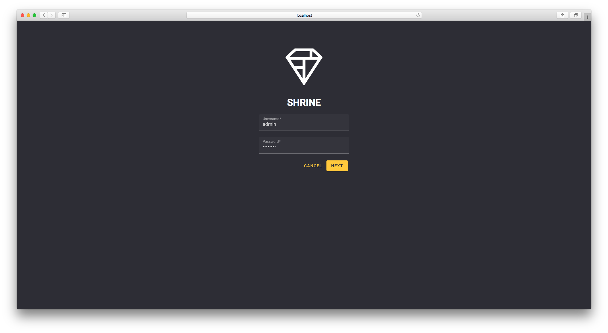

# googlemdc - web material components
[know codelabs by Google](https://codelabs.developers.google.com/codelabs/mdc-101-web/#0)
> Introduction: 	
Material Components (MDC) help developers implement Material Design. Created by a team of engineers and UX designers at Google, MDC features dozens of beautiful and functional UI components and is available for Android, iOS, web and Flutter.
material.io/develop

## to run this project, you will need:
* [a recent version of node.js](https://nodejs.org/en/)
* [node package manager](https://www.npmjs.com/)

## run
initial commands line to init:

```
$ npm install
```

```
$ npm start
```

## login screen [dark build]


## products galery [dark build]


### Thanks for watching :)
